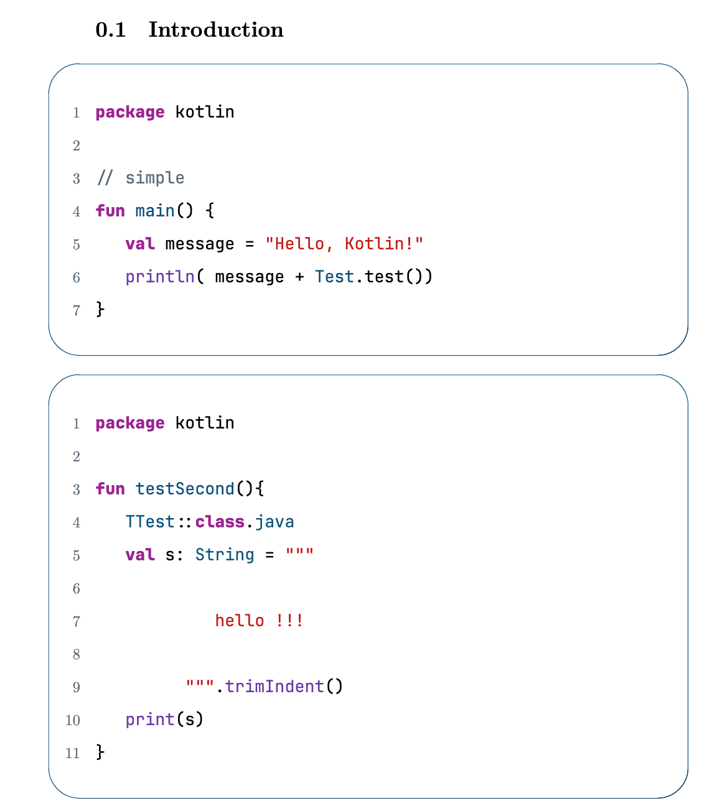
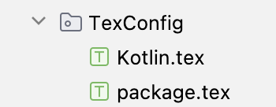
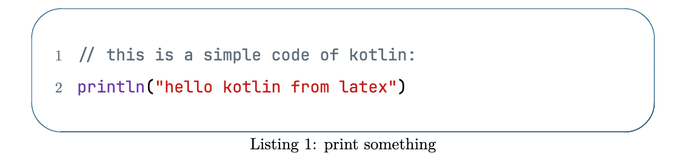
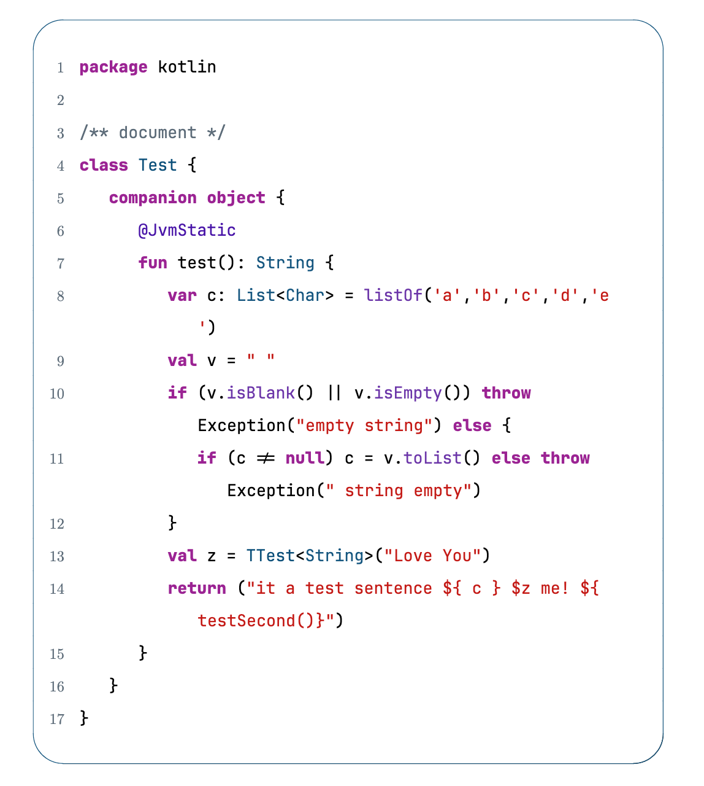

# Kotlin for LaTeX Listings Plus
 [Kotlin](https://kotlinlang.org/)  language template for Latex.

it base on [**Kotlin for LaTeX Listings**](https://github.com/cansik/kotlin-latex-listing?tab=readme-ov-file)  

Theme referred to Xcode

[](https://github.com/JunSilckTar/Kotlin-for-LaTeX-Listings-Plus/blob/main/png/%E6%88%AA%E5%B1%8F2024-05-09%2017.09.40.png)

## How to use it?

##### First.  

Download files named **Kotlin.tex** and **package.tex** on **TexConfig**

Or copy that code on **Kotlin.tex**  to your .tex file 



if you copy code or just use  **Kotlin.tex**, you HAVE to 

Delete **\input{TexConfig/package}**

Add **\usepackage[dvipsnames]{xcolor}**  **\usepackage{listings}** and **\usepackage{fontspec}**

```latex
% delete this on Kotlin.tex
\input{TexConfig/package}

% add this on Kotlin.tex
\usepackage[dvipsnames]{xcolor}
\usepackage{listings}
\usepackage{fontspec}
```


##### Second. 

Import file **Kotlin.tex**  just like this

```latex
\documentclass[a4paper, 11pt]{report}
\input{TexConfig/Kotlin} %  care the location where Kotlin.tex is
\title{My First Document}
```


##### Third.

One way to use:

```latex
\begin{lstlisting}[caption={print something}, label={lst:kt}, language=Kotlin]
// this is a simple code of kotlin:
println("hello kotlin from latex")
\end{lstlisting}
```

Then listing should look like this:



Another way to use:

``````latex
\lstinputlisting[label={lst:kt3}, language=Kotlin]{Kotlin/Test.kt}
``````




It is recommended that you split your code into different files, or use the first way

## Define additional topics

```Latex
% use \lstdefinelanguage define language
\lstdefinelanguage{languageName}{
    style = styleName,
}
% use \lstdefinestyle define language style
\lstdefinestyle{styleName}{
		basicstyle=\normalfont\ttfamily\normalsize,
		more style setting...
}

```

## Thanks

Thank you for your contributions [@cansik](https://github.com/cansik)

 
